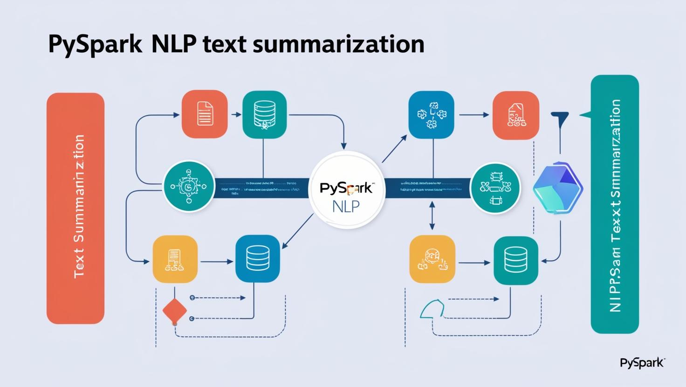

# NLP Text summarization using power of PySpark

Natural Language Processing (NLP) empowers computers to comprehend, interpret, and communicate using human language. It plays a crucial role in tasks such as language translation, sentiment analysis, summarization, pattern recognition, and text generation. These capabilities have made NLP indispensable across various domains, including customer service, healthcare, and content moderation.

In real-world applications, NLP systems often process massive datasets, such as streams of social media posts, articles, or logs, far exceeding the computational capacity of single-machine CPUs or GPUs. To address this challenge, distributed systems have become essential, enabling parallel processing and scalability.
The PySpark library, a powerful tool for big data processing, extends support for NLP operations within distributed environments. By leveraging PySpark's scalability and fault-tolerant architecture, NLP tasks can be executed efficiently, even on large datasets.

This project focuses on text summarization, a key NLP application, using articles retrieved from the Associated Press (AP) News. It demonstrates how PySpark's capabilities can be harnessed to process and distill insights from vast volumes of textual data, providing concise and meaningful summaries.

# Data Source
[Article from AP News](https://apnews.com/article/mideast-wars-israel-gaza-lebanon-5dbfc18c7311a6b3eb16c89981bd3dfb)

# Important Links
[PySpark Code for Text Summarization](./PySpark_Summarization.ipynb)
